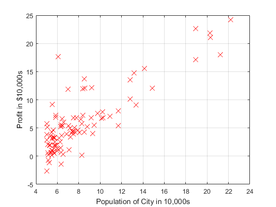
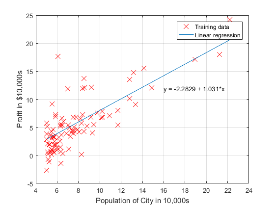
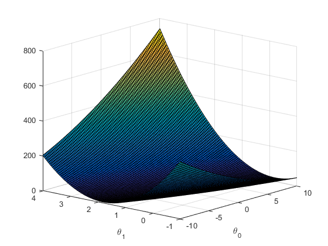

# Exercise 1 - Linear Regression

This exercise explores the power of linear regression for obtaining linear models to two-dimensional and multi-dimensional datasets. Models allow us to obtain estimations for an unknown variable given information known variables.

## Linear Regression fundamentals

Linear Regression is a mathematical process which aims to obtain a linear model of the type , with  and  being n-dimensional vectors, which is the closest as possible to the actual data (x,y). In other words, we aim to have  the closest as possible to .

In order to translate this definition to mathematical terms, we define a cost function  which measures the distance from the linear model  to the actual data points (x,y). Then, we run an optimization algorithm which finds the optimal parameter vector  such that, for the specific data we have, the cost function is minimized.

In the following sections, there will be presented examples of 2D Linear Regression, where *x* and *y* are single variables, and Multi-dimensional Linear Regression, where *x* is a n-dimensional variable (that is, a set of variables).

## Two-dimensional Linear Regression

For the 2D Linear Regression, this exercise uses a dataset which relates the profit *x* of a food truck business over several diferents cities of population *y*. The plot below shows the data available in file *ex1data1.txt*. Obtaining a model for the data below allow us to obtain means for estimating the profit of the business in a city where the food truck is not present, given this city's population.

### Defining the cost function

As we aim to have  the closest as possible to , the cost function can be defined as the sum of squared errors for all data points in the dataset. Assuming *m* is the number of datapoints in the dataset, we have:

### Gradient Descent Algorithm

There are unnumbered optimization algorithms avaialable, but Gradient Descent usually stands out thanks to its simplicity and low-computational cost. 

### Obtaining a Linear Model for the data

### Plotting the cost function just for fun

